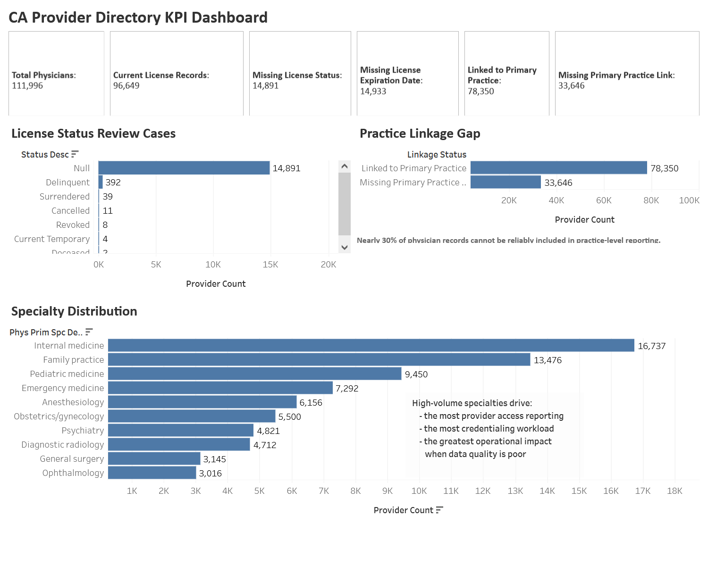
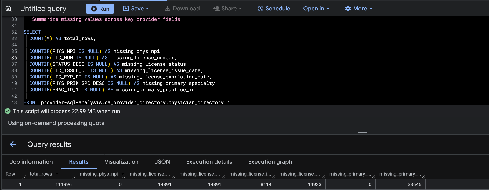
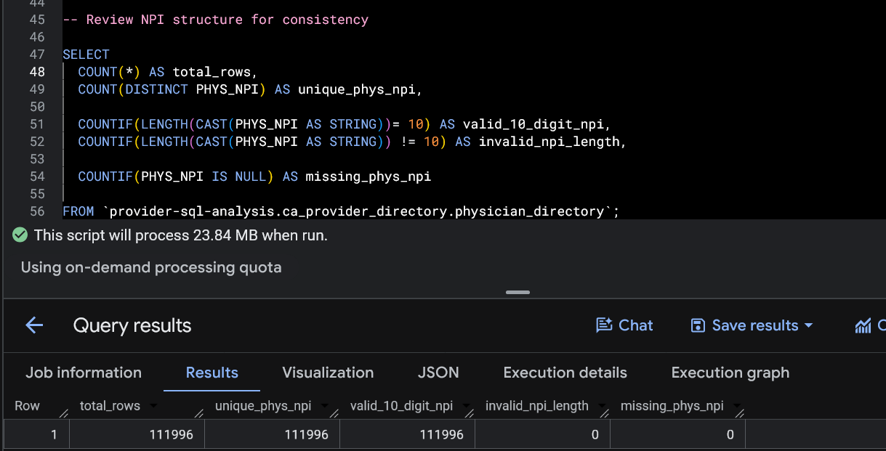
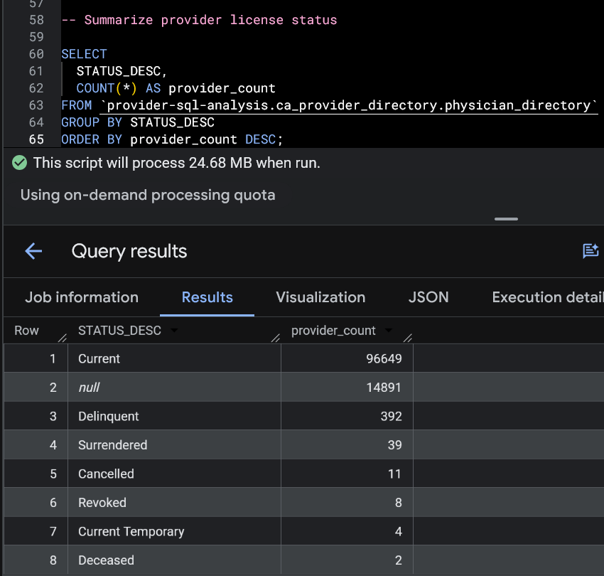
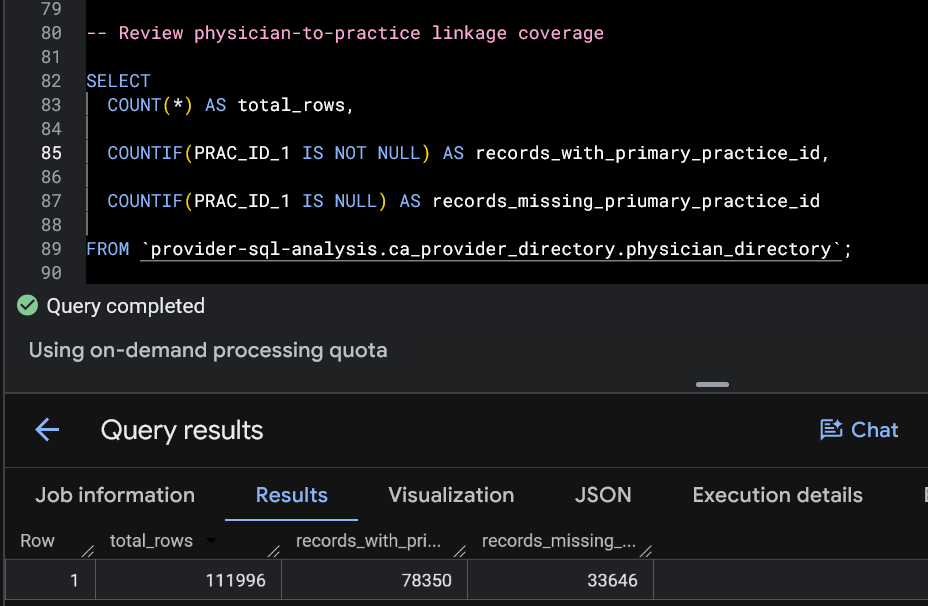
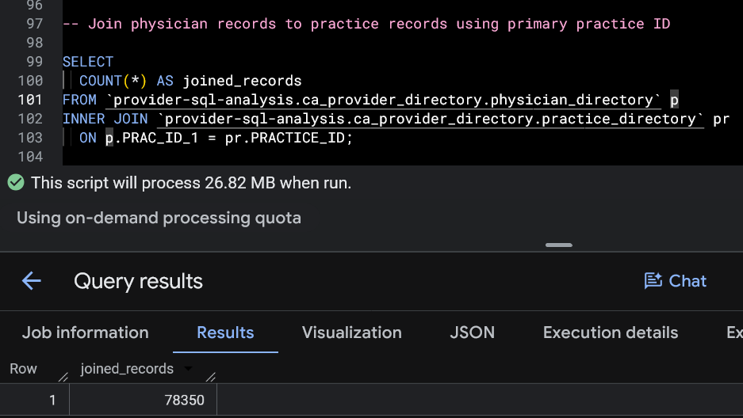
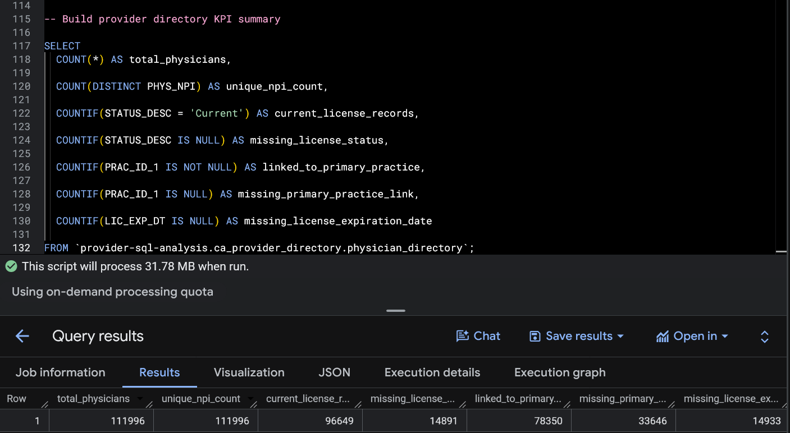

# CA Provider Directory SQL Analysis

SQL | Google BigQuery | Data Validation | KPI Reporting | Healthcare Operations

---

## Key Takeaways

* Validated 111,996 California physician records and confirmed full NPI coverage with no missing, duplicate, or invalid 10-digit NPI values, creating a reliable provider-level identifier for provider matching and reporting.

* Identified the largest reporting gap in physician-to-practice linkage, where 33,646 records were missing a primary practice ID, limiting provider attribution, network analysis, and practice-level reporting.

* Found 14,891 records missing license status and 14,933 missing license expiration dates, creating review gaps where provider eligibility could not be clearly verified.

* Confirmed that all 78,350 physician records with a primary practice ID successfully matched a valid practice record, showing strong physician-to-practice relationship integrity when linkage fields were present.

* Provider-level structure was strong, while incomplete license fields and missing practice relationships reduced reporting reliability for operational use.

---

## Project Overview

This project evaluates how reliable a provider directory is for credentialing review, provider reporting, and physician-to-practice analysis.

Using California physician directory public use files from AHRQ, the analysis focused on provider identity quality, license review, specialty reporting, and physician-to-practice linkage using SQL in Google BigQuery. The goal was to identify where the directory supports reliable reporting and where incomplete records create operational gaps.

The project was built around provider operations because directory accuracy directly affects payer matching, provider eligibility review, network reporting, and access analysis.

---

## Business Problem

Provider directories support credentialing, provider enrollment, payer matching, provider access reporting, and network adequacy analysis. Missing provider identifiers, incomplete license records, or weak physician-to-practice relationships reduce reporting accuracy and create unnecessary manual review across provider operations teams.

This project focuses on identifying where the physician directory supports reliable provider-level reporting and where incomplete records create risk for operational decision-making.

---

## Dataset

Source: AHRQ Physician and Physician Practice Research Database (3P-RD)

Dataset download:
https://www.ahrq.gov/data/innovations/3p-rd.html

Primary table:

* CA_Physician_Directory_PUF.csv

Supporting table:

* CA_Physician_Practice_Directory_PUF.csv

Additional geographic files were reviewed but were not necessary for the core SQL analysis.

### Record Volume

* Physician records: 111,996
* Practice records: 26,954

---

## Tools Used

* SQL
* Google BigQuery
* AHRQ 3P-RD Public Use Files
* Data Validation
* KPI Reporting
* Healthcare Provider Operations Analysis
* Tableau

---

## Project Structure

```text
CA-Provider-Directory-SQL-Analysis/
├── data/
│   ├── CA_Physician_Directory_PUF.csv
│   └── CA_Physician_Practice_Directory_PUF.csv
│
├── sql/
│   ├── 01_table_setup_and_schema_review.sql
│   ├── 02_data_validation.sql
│   ├── 03_credentialing_review.sql
│   ├── 04_provider_practice_linkage.sql
│   └── 05_reporting_summary.sql
│
├── screenshots/
│   ├── 03_missing_value_summary.png
│   ├── 04_npi_structure_review.png
│   ├── 05_license_status_summary.png
│   ├── 07_provider_practice_linkage_review.png
│   ├── 09_join_validation.png
│   └── 11_final_kpi_summary.png
│
├── tableau/
│   ├── exports/
│   │   ├── final_kpi_summary.csv
│   │   ├── license_status_summary.csv
│   │   ├── specialty_distribution.csv
│   │   ├── practice_linkage_summary.csv
│   │   └── practice_linkage_summary_tableau.csv
│   │
│   ├── dashboard_screenshots/
│   │   └── main_dashboard.png
│   │
│   └── California_Provider_Directory_Dashboard.twb
│
└── README.md
```
---

## How to Review This Project

1. Start with this README for project context, findings, and business impact

2. Review the SQL files in the `sql/` folder to see the validation logic, joins, and KPI reporting queries

3. Review the screenshots folder for BigQuery outputs and final reporting summaries

4. Use the AHRQ dataset source to recreate the analysis in Google BigQuery if needed

---

## Tableau Dashboard

  
Interactive dashboard built from the SQL reporting outputs and provider directory validation analysis.

Tableau Public:  
https://public.tableau.com/app/profile/alfred.rico/viz/CAProviderDirectoryKPIDashboard/CAProviderDirectoryKPIDashboard

---

## Technical Implementation

### Table Validation and Schema Review

The first step was confirming the physician directory loaded correctly and reviewing how BigQuery interpreted key fields such as NPI, license dates, specialty descriptions, and practice IDs.

This established the structure of the dataset before validation work began and made sure key provider fields could support reliable analysis.

---

### Missing Value Review



Core provider fields were reviewed across NPI, license number, license status, expiration dates, specialty values, and primary practice IDs to measure reporting reliability before deeper validation.

Provider identity coverage was strong, with no missing NPI values and no missing primary specialty values. The largest gap appeared in physician-to-practice linkage, where 33,646 records were missing a primary practice ID.

License-related fields also showed meaningful missingness across status and expiration tracking, creating review gaps for incomplete provider records.

---

### NPI Structure Review



NPI was reviewed separately to confirm uniqueness, formatting consistency, and provider-level reliability.

All 111,996 physician records contained a unique and correctly formatted 10-digit NPI with no missing values and no invalid lengths, making NPI fully reliable as the primary provider identifier for reporting and provider matching.

---

### License Status Review



License status was grouped to measure active provider coverage and identify incomplete records.

Most providers were listed as Current, with 96,649 active records supporting stronger provider network reporting. The largest issue was 14,891 records with missing license status values, where provider eligibility could not be clearly classified.

Smaller categories such as Delinquent, Revoked, Cancelled, and Surrendered were low in count but still represent higher-priority review because they directly affect provider participation.

---

### License Expiration Review

License expiration dates were reviewed to identify incomplete expiration tracking and provider review risk.

Most records contained expiration dates earlier than the current date, while 14,933 records were missing expiration dates entirely.

Because the dataset is a public use file rather than a live operational directory, expiration date review was most useful for identifying incomplete credentialing fields and reporting limitations.

---

### Provider-to-Practice Linkage Review



Primary practice IDs were reviewed to determine how many physician records could be connected to practice-level reporting.

78,350 physician records contained a usable primary practice ID, while 33,646 records were missing that relationship entirely.

This means roughly 30% of physician records cannot be reliably included in practice-level reporting, even when the provider record itself is otherwise usable.

---

### Join Validation



The physician and practice tables were joined using the primary practice key to validate physician-to-practice relationship integrity.

All 78,350 physician records with a primary practice ID successfully matched a valid practice record.

This confirmed the main issue was missing linkage coverage rather than broken join quality. When the primary practice key exists, the physician-to-practice relationship is reliable.

---

### Specialty Distribution Review

Primary specialty values were grouped to identify where provider volume is concentrated and where reporting quality has the greatest operational impact.

The largest specialty groups were Internal Medicine, Family Practice, Pediatric Medicine, and Emergency Medicine.

These specialties drive the largest share of provider access reporting and provider review workload, which makes data quality especially important in these areas.

---

### Final KPI Summary



The final step combined the strongest findings into one reporting view covering provider volume, identifier reliability, current license status, missing license fields, and physician-to-practice linkage coverage.

This created a clearer operational summary and better reflects how provider operations teams review reporting quality in practice.

---

## Business Recommendations

* Prioritize manual review for records missing license status or expiration dates before using the directory for provider eligibility reporting.

* Separate providers missing primary practice IDs from practice-level reporting so provider attribution and network analysis remain accurate.

* Use NPI as the primary provider identifier because it showed full coverage, correct structure, and no duplicate values across all physician records.

* Review expiration dates with dataset context in mind since the public use file includes historical provider records in addition to current records.

* Build recurring SQL validation checks for NPI coverage, license status, expiration tracking, and practice linkage before refreshing provider directory reports.

---

## Final Summary

This project applies SQL to provider directory validation, reporting readiness, and operational review using real healthcare provider data.

The physician directory showed strong provider-level reliability through complete NPI coverage and consistent physician-to-practice joins, while incomplete license fields and missing practice linkage created the largest reporting limitations.

This project demonstrates SQL-based validation, reporting, and operational decision support using real healthcare provider data.

---

## Ecosystem

Portfolio webpage → Project hub and navigation:
https://alfredrico.github.io/

GitHub → Project repositories featuring UV management for reproducibility:
https://github.com/AlfredRico
